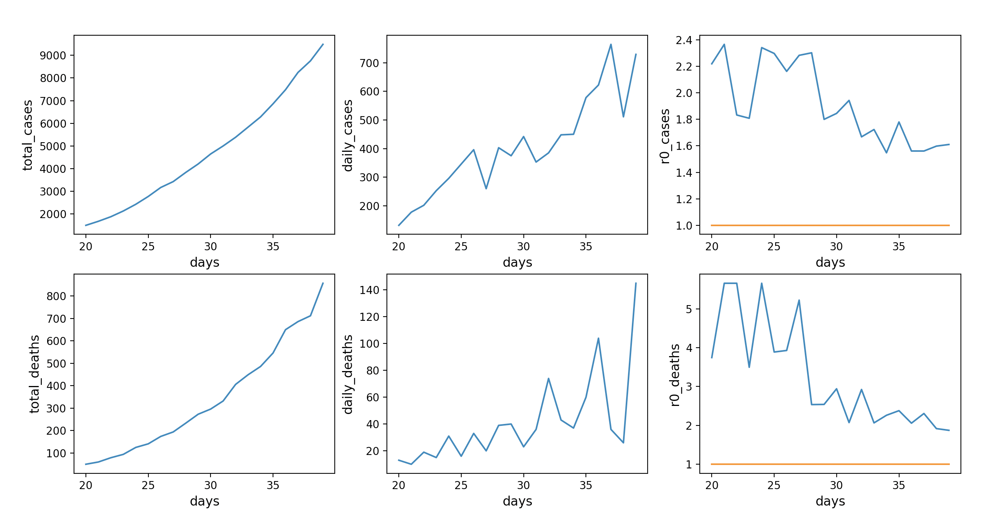
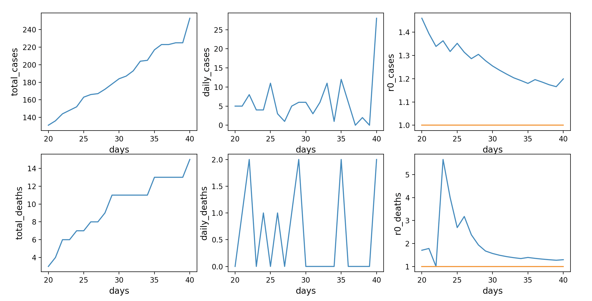

# rt_estimator
Computes graphs of Rt (Transmission Rate) for an epidemic. 

WORK IN PROGRESS - results likely to be wrong while I debug

Useful for Mexico where I can not find such a plot

## Example output:

### All of Mexico

### Jalisco

